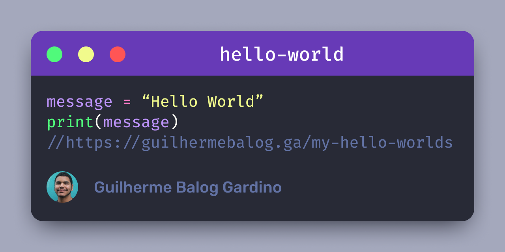

# My Hello Worlds



👨🏾‍💻 This is a web page with some languages that I know:

- [HTML](https://github.com/GuilhermeBalog/tic-tac-toe)
- [CSS](https://github.com/GuilhermeBalog/guilhermebalog.github.io)
- [JavaScript](https://github.com/GuilhermeBalog/capivara-chat)
- [Python](https://github.com/GuilhermeBalog/exercicios-de-python)
- [C++](https://github.com/GuilhermeBalog/exercicios-de-cpp)
- [Java](https://github.com/GuilhermeBalog/gerador-de-relatorios)

**Available at:** [guilhermebalog.ga/my-hello-worlds](https://guilhermebalog.ga/my-hello-worlds)

## Getting Started

- Clone the repository with

```bash
git clone https://github.com/GuilhermeBalog/my-hello-worlds.git
```

- Open the `index.html` file on your favorite browser!

> Feel free to fork this repo and add your ideias!

*That's all folks! Keep coding!*
